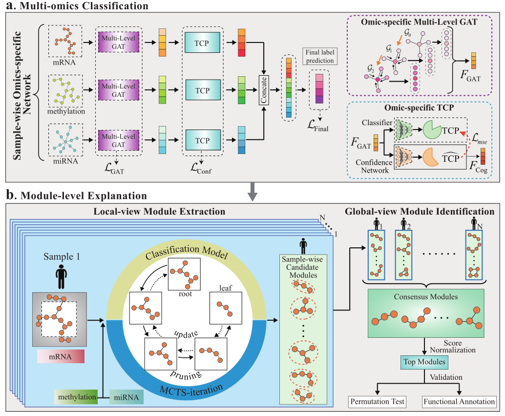

# GREMI: an Explainable Multi-omics Integration Framework for Enhanced Disease Prediction and Module Identification

By capturing complementary information from multiple omics data, multi-omics integration has demonstrated promising performance in disease prediction. As the number of omics data increases, effectively representing the data and avoiding mutual interference becomes challenging due to the intricate relationships within and among omics data. Here, we propose a novel multi-omics integration framework that improves diagnostic prediction.

# Overview



Our framework involves:
- Constructing co-expression and co-methylation networks for each subject
- Applying multi-level graph attention to incorporate biomolecule interaction information
- Utilizing a true-class-probability strategy to evaluate omics-level confidence for classification
- Designing the loss using an adaptive mechanism to leverage both within- and across-omics information

Extensive experiments demonstrate that the proposed framework outperforms state-of-the-art methods on classification tasks and indicates that the integration of three omics yields superior performance compared to employing only one or two data types.

# Requirements

- Python 3.6
- PyTorch 1.10.2
- PyTorch Geometric
- scikit-learn
- numpy

Create a conda environment using the provided `environment.yml` file:

```sh
conda env create -f environment.yml
conda activate greml-env
 ``` 

# Data Preparation
The data used can be obtained through https://github.com/txWang/MOGONET. We also provide the in-house processed data of extra three diseases. In our study, data from three omics were merged into one file. 

# Usage
## Setting up the environment
1. Clone the repository and navigate to the project directory:
```
git clone https://github.com/Yaolab-fantastic/GREMI.git
cd GREMI
```
2. Activate the conda environment:
```
conda activate greml-env
```
3.Ensure you are in the correct working directory:
```
cd /path/to/your/project
```
## Running the model
To get the classification result, run the following command:
```
python model-test.py
```
## Results
After running the model, you can expect to see the classification results which demonstrate the efficacy of our multi-omics integration approach.


# Disclaimer

This tool is for research purpose and not approved for clinical use.

# Coypright

This tool is developed in Yao Lab.

The copyright holder for this project is Yao Lab.

All rights reserved.

# Citation
If you use this framework in your research, please cite our work:

 ``` 
@article {Liang2023.03.19.533326,
    author = {Liang, Hong and Luo, Haoran and Sang, Zhiling and Jia, Miao and Jiang, Xiaohan and Wang, Zheng and Yao, Xiaohui and Cong, Shan},
    title = {GREMI: an Explainable Multi-omics Integration Framework for Enhanced Disease Prediction and Module Identification},
    elocation-id = {2023.03.19.533326},
    year = {2023},
    doi = {10.1101/2023.03.19.533326},
    publisher = {Cold Spring Harbor Laboratory},
    URL = {https://www.biorxiv.org/content/early/2023/11/15/2023.03.19.533326},
    eprint = {https://www.biorxiv.org/content/early/2023/11/15/2023.03.19.533326.full.pdf},
    journal = {bioRxiv}
}
 ``` 
